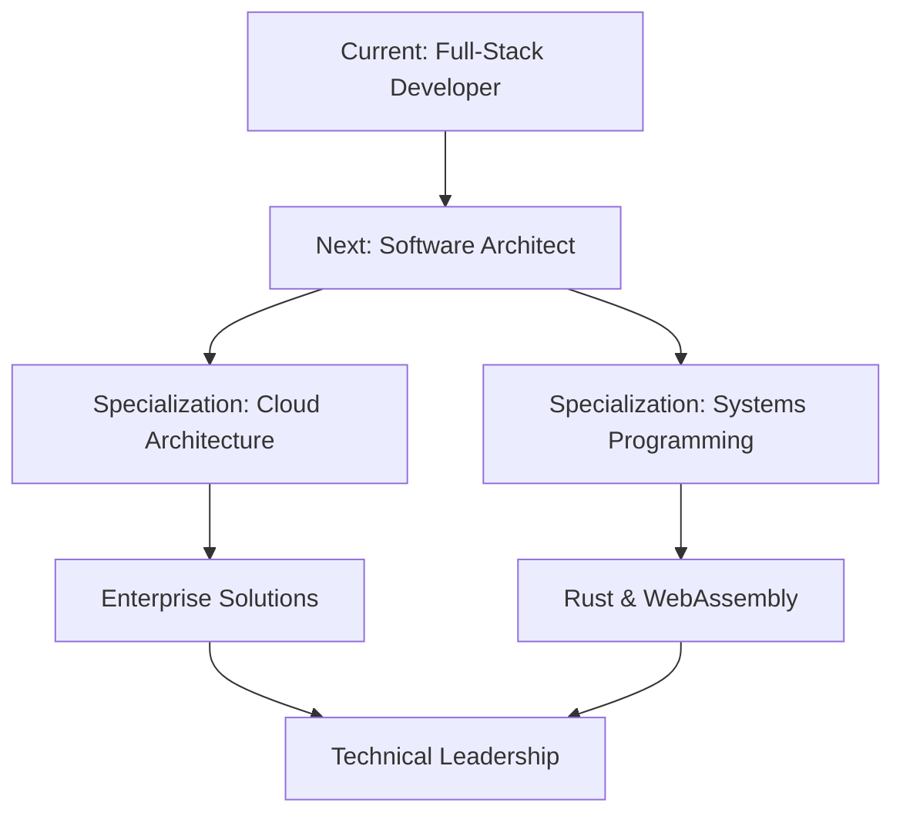

<!--
**comlyboy/comlyboy** is a ✨ _special_ ✨ repository because its `README.md` (this file) appears on your GitHub profile.

Here are some ideas to get you started:

- 🔭 I’m currently working on ...
- 🌱 I’m currently learning ...
- 👯 I’m looking to collaborate on ...
- 🤔 I’m looking for help with ...
- 💬 Ask me about ...
- 📫 How to reach me: ...
- 😄 Pronouns: ...
- ⚡ Fun fact: ...
-->

# Hi there! 👋 I'm Cornelius Okeke

## 🚀 About Me

I'm a passionate **Software Developer** with a unique background in **Business Administration**, specializing in building **scalable, efficient, and innovative applications**. My expertise bridges the gap between business requirements and technical implementation, focusing on **backend development**, **cloud architecture**, and **emerging technologies**.

> *"Transforming business ideas into robust, scalable software solutions"*

---

## 🛠️ Technology Stack

### **Backend Development**

### **Frontend Development**

### **Cloud & DevOps**

### **Databases**

### **AI & Machine Learning**

### **Testing & Quality**

### **Systems Programming**

---

## 📊 GitHub Statistics

---

## 💡 Core Competencies

<table>
<tr>
<td valign="top" width="33%">

### 🏗️ **Architecture & Design**
- **Microservices Architecture**
- **Serverless Computing**
- **API Design & Development**
- **System Scalability**
- **Performance Optimization**

</td>
<td valign="top" width="33%">

### 🤖 **AI Integration**
- **GPT & Whisper APIs**
- **Prompt Engineering**
- **Model Context Protocol (MCP)**
- **AI-driven Feature Development**
- **ML Model Integration**

</td>
<td valign="top" width="33%">

### ☁️ **Cloud Technologies**
- **AWS Services** (EKS, CDK, Lambda, S3, SNS, SQS)
- **Azure Platform** (App Service, Blob Storage)
- **Infrastructure as Code**
- **CI/CD Pipelines**
- **Container Orchestration**

</td>
</tr>
</table>

---

## 🔥 Featured Projects

### 🎯 **Current Development Focus**

| Project | Technologies | Status | Description |
|---------|-------------|---------|-------------|
| **Stream Application** | NestJS, AWS Lambda, Serverless | 🚀 Active | High-performance streaming platform with serverless architecture |
| **SaaS RBAC System** | AWS IAM, DynamoDB, NestJS | 🔧 Development | Enterprise-grade role-based access control inspired by AWS IAM |
| **Enterprise ERP Suite** | Angular, NestJS, PostgreSQL | 📈 Scaling | Complete business management system (Inventory, CRM, POS, Warehousing) |
| **Real-time Chat Platform** | React, WebSocket, AWS S3, Azure Blob | 💬 Beta | WhatsApp-inspired messaging with cloud media storage |
| **Hospitality Showcase** | React, Tailwind CSS, AWS | 🏨 Live | Digital business profiles for hospitality industry |
| **KYC Verification Platform** | NestJS, AI APIs, DynamoDB | 🔐 Production | Automated identity and address verification system |

---

## 🎯 Professional Objectives

### 🌟 **Career Roadmap**
- 🏗️ **Software Architecture Mastery** - Design scalable, maintainable systems
- 🦀 **Systems Programming Expertise** - Rust, Performance Optimization, Memory Safety
- 👥 **Technical Leadership** - Mentoring teams and driving technical decisions
- 🌐 **Open Source Contribution** - Contributing to developer community

---

## 📈 Activity & Contributions

---

## 🏆 Achievements & Recognition

- 💼 **Business Administration Background** - Unique blend of technical and business expertise
- 🚀 **Startup Experience** - Built products from concept to production
- ☁️ **Cloud Certified** - AWS and Azure platform expertise
- 🤖 **AI Pioneer** - Early adopter of AI integration in software development
- 🦀 **Systems Programming Enthusiast** - Currently mastering Rust for high-performance applications

---

## 📚 Knowledge Sharing

I believe in giving back to the developer community through:
- 📝 **Technical Documentation** - Comprehensive project documentation
- 🎯 **Best Practices** - Sharing architecture patterns and development methodologies
- 🤝 **Mentorship** - Guiding junior developers in their career journey
- 🔄 **Open Source** - Contributing to community projects

---

## 🤝 Let's Connect & Collaborate

**I'm always interested in discussing:**
- 🏗️ Software Architecture & System Design
- ☁️ Cloud Computing & DevOps
- 🤖 AI Integration & Automation
- 🦀 Systems Programming & Rust
- 💼 Business-Driven Development

*"Let's build something amazing together!"* 🚀

---

### 💭 *"The best way to predict the future is to create it."*

**Thank you for visiting my profile! ⭐ Star some repositories if you find them interesting!**

